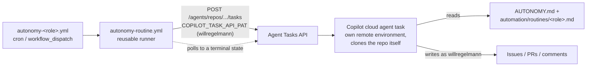

# Autonomous routines

Definitions for the scheduled agents that run the autonomous research
experiment (`AUTONOMY.md`, `EXPERIMENT.md`). Each routine is registered as a
claude.ai scheduled agent whose prompt is a thin pointer; **behavior lives in
these files**, which are version-controlled and constitutionally protected.

## Registration

Register each routine with this pointer prompt (replace `<role>`):

> You are the `<role>` routine of the self-consistency autonomous research
> experiment. Read AUTONOMY.md at the repository root first, then read
> `automation/routines/<role>.md` and execute it exactly. If
> `automation/routines/<role>.md` does not exist on this branch, the
> experiment infrastructure has not landed yet — exit immediately without
> taking any action.

Source: this repository, branch `main`. GitHub identity for routine-created
content: the experimenter's own account (`willregelmann`), via the
`COPILOT_TASK_API_PAT` secret (see "Deployed instances" below) — **not** the
machine account, as of the 2026-07-12 compute migration described below.

> **Runner note (2026-06-09).** The routines were originally registered as
> claude.ai scheduled remote agents. That runner authenticates GitHub with the
> account's *global* connector — i.e. the experimenter's admin login — which
> voided the machine-account identity the whole authority model depends on
> (EXPERIMENT.md log). The routines then ran as **GitHub Actions scheduled
> workflows** instead, authenticating with a credential under our control
> (`AUTONOMY_BOT_PAT`, machine account `will-physagent`). The pointer prompt
> above was unchanged throughout — it's what the reusable workflow feeds to
> whatever's doing the actual reasoning.

> **Compute migration (2026-07-12).** The reusable workflow no longer runs a
> headless Claude Code CLI session. It starts a GitHub Copilot cloud agent
> task via the Agent Tasks REST API and polls it to completion — the pointer
> prompt is unchanged, only the compute substrate underneath it. This also
> changed *which identity* authors routine content: Copilot licenses are
> per-user, the machine account doesn't have one, and buying it a seat was
> deferred (cost). Routine content is now created and authored under the
> experimenter's own account instead — a deliberate, logged tradeoff (see
> `EXPERIMENT.md` log and `docs/ARCHITECTURE.md`'s Identity and authority
> section for why this is not a repeat of the 2026-06-05 incident). Dispatch
> flow:

## Registry

| Routine | Cadence (UTC) | Model (current default) | File |
|---------|--------------|-------|------|
| worker | daily 06:00 | opus | `worker.md` |
| reviewer | 12h (05:00, 17:00; +1h redundant fires) | opus | `reviewer.md` |
| responder | daily 04:00 | sonnet | `responder.md` |
| red-team | every 3 days 08:00 | opus | `red-team.md` |
| scout | weekly Mon 03:00 | sonnet | `scout.md` |
| librarian | weekly Tue 03:00 | sonnet | `librarian.md` |
| governor | weekly Sun 05:00 (light pass); full pass 1st of month | opus | `governor.md` |

Model is repo-var-driven, not pinned in these files — see "Shared deployment
configuration" below; the column above shows the current default only.

Cadence rationale: responder (04:00) runs before reviewer (05:00) runs before
worker (06:00) — fixes land, get re-reviewed, then new work starts against an
up-to-date queue. Governor runs Sunday 05:00, deliberately before the Monday
scout/metrics/digest, so any thread it promotes that run enters the new
week's queue immediately (EXPERIMENT.md 2026-06-10 amendment).

## Deployed instances (GitHub Actions, 2026-06-09; compute migrated 2026-07-12)

The routines run as **GitHub Actions scheduled workflows** in this repository.
Each role has a thin scheduled caller (`.github/workflows/autonomy-<role>.yml`)
that invokes the reusable runner (`.github/workflows/autonomy-routine.yml`) with
its role and model. This table is the record of the live deployment; if it
drifts from the workflow files, this file is wrong — fix it.

| Routine | Workflow file | Cron (UTC) | Model (current default, Agent Tasks API ID) |
|---------|---------------|------------|-------|
| worker | `autonomy-worker.yml` | `0 6 * * *` | claude-opus-4.6 |
| reviewer | `autonomy-reviewer.yml` | `0 5,6,17,18 * * *` | claude-opus-4.6 |
| responder | `autonomy-responder.yml` | `0 4 * * *` | claude-sonnet-5 |
| red-team | `autonomy-red-team.yml` | `0 8 */3 * *` | claude-opus-4.6 |
| scout | `autonomy-scout.yml` | `0 3 * * 1` | claude-sonnet-5 |
| librarian | `autonomy-librarian.yml` | `0 3 * * 2` | claude-sonnet-5 |
| governor | `autonomy-governor.yml` | `0 5 * * 0` | claude-opus-4.6 |

Model IDs for the Agent Tasks API do not match the old Claude Code CLI's IDs
(confirmed by direct testing: `claude-opus-4-8` 400s — "model not found";
`claude-opus-4.6` is the available ceiling; `claude-sonnet-5` is available and
newer than the prior `claude-sonnet-4-6` default).

Shared deployment configuration (all seven, in the reusable runner):

- **Runner:** `ubuntu-latest`; each run POSTs to the Agent Tasks API and polls
  the resulting task to a terminal state (`queued` → `in_progress` →
  `completed`, or a failure state). No local checkout, no CLI install — the
  Copilot cloud agent task clones and works on the repo itself, remotely, in
  its own environment. This is a bigger change than it sounds: through
  2026-07-12 the runner *was* the compute (a headless CLI session executing
  on the Actions runner itself); since then the runner is just a thin
  dispatcher, and the actual reasoning happens entirely off-runner.
- **Prompt:** the pointer template above, unchanged — behavior lives in the
  version-controlled `<role>.md` files, never in the workflow, exactly as
  before the compute migration.
- **Model:** each role's `autonomy-<role>.yml` reads
  `${{ vars.MODEL_<ROLE> || '<default>' }}` and passes the result as the
  Agent Tasks API's `model` parameter — the table above shows the current
  default for each role. Changing a role's model is still `gh variable set
  MODEL_<ROLE> <id>`, no PR required (EXPERIMENT.md 2026-06-13 amendment) —
  just make sure the ID is one the Agent Tasks API recognizes, not a CLI ID.
- **Permissions:** N/A to this runner directly — the Copilot cloud agent task
  runs in its own sandboxed environment under GitHub's control, with its own
  tool/network policy (see the repo's Settings → Copilot pages), not this
  workflow's.
- **Claude auth:** `CLAUDE_CODE_OAUTH_TOKEN` is **no longer used by this
  runner** (it's still used elsewhere: `semantic-review`'s claim-support
  evaluator, `digest.yml`'s significance pass).
- **GitHub identity:** `COPILOT_TASK_API_PAT`, a personal access token under
  the experimenter's own account (`willregelmann`) — **not** the machine
  account. Copilot licenses are per-user and the machine account
  (`will-physagent`) doesn't have one (confirmed by a live 403: "This API
  requires a valid Copilot license"); buying it a seat was considered and
  deferred as a cost decision. This is a deliberate, logged tradeoff, not an
  unguarded accident — see `docs/ARCHITECTURE.md`'s Identity and authority
  section for why this specifically does not repeat the 2026-06-05 incident
  (the two gates whose safety property depended on machine-account-only
  identity were retired the same day, before this migration landed). The
  runner logs the effective identity every run instead of guarding against
  it. `AUTONOMY_BOT_PAT` (the machine account's PAT) still exists and is
  still used by `metrics.yml` and `autonomy-identity-probe.yml` — just not by
  this file any more.

### Kill switch

Step 1 of the kill switch is the repo variable **`AUTONOMY_ENABLED`**: the
reusable runner skips every routine unless it is exactly `true`. Set it to
`false` (or unset it) to halt the whole fleet in one action; individual roles
can also be disabled from the Actions tab. (The full kill switch — budget, PAT
revocation — is in `EXPERIMENT.md`, which as of 2026-07-12 needs to revoke
both `AUTONOMY_BOT_PAT` and `COPILOT_TASK_API_PAT` for a hard stop.)

### Enablement runbook

1. Set the `COPILOT_TASK_API_PAT` secret to a personal access token under the
   identity routine content should be authored as (currently the
   experimenter's own account — see "GitHub identity" above).
2. Merge these workflows to `main` (scheduled/dispatch workflows only run from
   the default branch).
3. Manually `gh workflow run` one low-stakes role (e.g. `autonomy-librarian.yml`)
   via `workflow_dispatch` and confirm it completes and produces correctly
   labeled, correctly attributed output before trusting the cron cadence.
4. Set `AUTONOMY_ENABLED=true` and record the start date in `EXPERIMENT.md`.

`autonomy-identity-probe.yml` still exists and still checks `AUTONOMY_BOT_PAT`
resolves to `will-physagent`, write-not-admin — that remains true and useful
for the credential's other uses (`metrics.yml`), but it no longer gates
whether the routine fleet itself can run.

Note on red-team cadence: `0 8 */3 * *` is day-of-month based, so the
interval compresses at month boundaries (e.g. the 31st → the 1st). Harmless;
recorded so nobody "fixes" it into a bug report.

Note on scheduled-workflow caveats: Actions cron can be delayed under load, and
scheduled workflows auto-disable after 60 days of no repository activity (a
non-issue during an active run).

## Shared conventions

- **State lives on GitHub** (labels, assignment locks, marker comments,
  branches) — every run reconstructs from scratch; nothing is remembered
  between runs. See each file's "reconstruction preamble".
- **Marker comments** are HTML comments, found by prefix and edited in place:
  `<!-- quorum:verdict ... sha=... -->`, `<!-- quorum:stress-test ... sha=... -->`
  (reviewer only), `<!-- worker:attempts n=K -->`, `<!-- red-team:audit ... -->`.
  Verdict markers are honored by the gate from **any** commenter as of
  2026-07-12 — the machine-account-only trust check was removed the same day
  as the compute migration (an accepted, logged risk; see `AUTONOMY.md`'s
  quorum tier bullet and the `EXPERIMENT.md` log for the reasoning).
- **Labels** are the state machine — normative table in `AUTONOMY.md`.
- **No routine merges manually.** GitHub auto-merge + the required-check stack
  is the only merge path.
