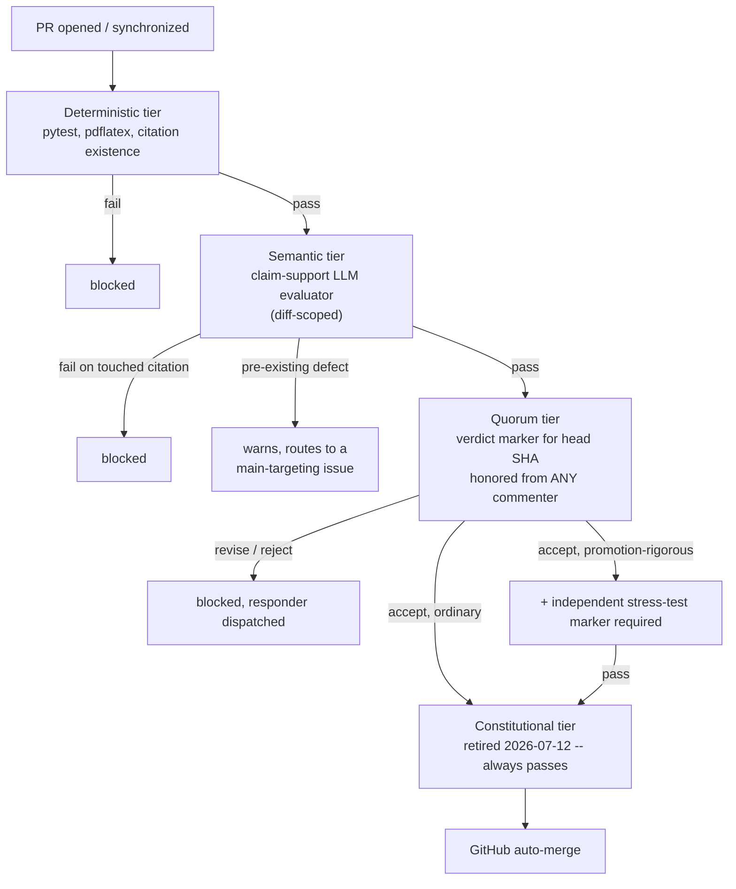
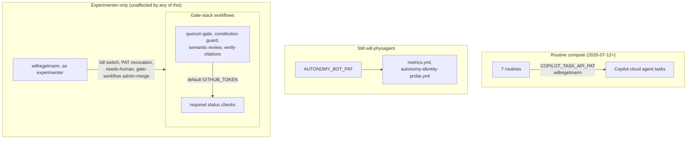

# Architecture: an application whose runtime is GitHub

This repository is not code hosted on GitHub. It is an application **running
on** GitHub: GitHub Actions is its compute, the label system is its state
machine, issues and pull requests are its database, branch protection is its
authorization layer, and the merged repository tree is its production state.
The "users" of the application are seven autonomous agent routines and one
human experimenter; its workload is a theoretical-physics research program.

This document is descriptive, not normative. The normative documents keep
their own vocabulary: [`AUTONOMY.md`](../AUTONOMY.md) is the constitution
(policy), [`EXPERIMENT.md`](../EXPERIMENT.md) is the pre-registration
(spec + changelog + incident log), [`METHODOLOGY.md`](../METHODOLOGY.md) is
the schema for research content. Where this document and those disagree,
those win.

## The mapping

| Application concept | Implementation |
|---|---|
| Compute / runtime | GitHub Actions runners that start and poll GitHub Copilot cloud agent tasks via the Agent Tasks REST API ([`autonomy-routine.yml`](../.github/workflows/autonomy-routine.yml)); the actual reasoning happens remotely in Copilot's own environment, not on the runner. Compute migrated 2026-07-12 from a headless Claude Code CLI session — see the mapping's Service account row and `EXPERIMENT.md` log |
| Processes | Seven routines — durable *roles* ([`automation/routines/`](../automation/routines/)), ephemeral *invocations* (one Actions run each) |
| Scheduler | cron triggers per role (`autonomy-<role>.yml`), with deliberate redundancy (reviewer double-fire) |
| Event bus | GitHub events: a quorum verdict comment dispatches the responder; an agent-PR push dispatches the reviewer ([`autonomy-event-dispatch.yml`](../.github/workflows/autonomy-event-dispatch.yml)). Cron remains the guaranteed backstop |
| State machine | The label system: `agent-ready` → claim (assignee lock) → `agent-pr` → per-SHA verdict → merged / `stuck` / `needs-human`. Transitions table in [`AUTONOMY.md`](../AUTONOMY.md) |
| Database | Issues, PRs, and the repository tree. Durable, queryable (`gh` is the query language), transactional (a merge is a commit, in both senses) |
| Schema | METHODOLOGY's rigor system: every result typed **Rigorous / Sketch / Conjecture**; demotions are migrations; withdrawn records are tombstones (never deleted) |
| Authorization | Branch protection (required checks, no direct pushes) + the merge-gate stack. Gate-workflow files (`.github/workflows/`) additionally require the calling PAT to lack the `workflow` scope — the one PAT-scope restriction still load-bearing after 2026-07-12 (see Identity and authority) |
| Service account | **Changed 2026-07-12.** Originally the machine account (repo variable `AUTONOMY_BOT` = `will-physagent`, via `AUTONOMY_BOT_PAT`), asserted at runtime by an identity guard that refused to act under any other login. Copilot licenses are per-user and the machine account doesn't have one (confirmed by a live 403), so routine content is now created and authored under the experimenter's own account (`willregelmann`), via `COPILOT_TASK_API_PAT` — a deliberate, logged tradeoff, not a reversion to the 2026-06-05 failure mode (see Identity and authority for why those aren't the same thing). `AUTONOMY_BOT_PAT` still exists and is still used by `metrics.yml` and `autonomy-identity-probe.yml` |
| Policy engine | The gate stack: deterministic tier (tests, paper builds, citation existence) → semantic tier (LLM claim-support evaluator) → quorum tier (adversarial verdict markers, per-SHA, honored from any commenter as of 2026-07-12 — no identity check left here either) → constitutional tier (retired 2026-07-12 to a no-op; gate-workflow files remain structurally protected by PAT scope, other protected paths no longer require approval). See the diagram below |
| Feature flag / kill switch | Repo variable `AUTONOMY_ENABLED`; one flip stops the fleet. Full kill-switch runbook in `EXPERIMENT.md` |
| Configuration | Repo variables (cadence gate, model per role) and secrets: `COPILOT_TASK_API_PAT` (routine compute, willregelmann), `AUTONOMY_BOT_PAT` (metrics/identity-probe, will-physagent), `CLAUDE_CODE_OAUTH_TOKEN` (semantic-review's claim-support evaluator and the digest's significance pass — unrelated to routine compute since 2026-07-12), SMTP |
| Observability | [Metrics dashboard issue](https://github.com/willregelmann/physagent/issues/67) (weekly snapshots → `metrics/`), [Breakthrough digest issue](https://github.com/willregelmann/physagent/issues/87) (weekly plain-English digest), Tier-A alert emails, Actions logs as traces |
| Release process | Workflow and constitution changes are deploys: experimenter-authored PRs, admin-merged, each recorded in the `EXPERIMENT.md` log |
| Incident log / postmortems | The same log — the 2026-06-05 identity halt, gate amendments, and instrumentation fixes are its entries |
| Integration test | The pre-registered terminal audit: fresh agents with no project context re-verify a sample of merged Rigorous results and every citation added during the run |

The gate stack, as it actually evaluates a PR today (post-2026-07-12):

Two tiers no longer check identity at all (quorum's verdict trust, and the
now-retired constitutional tier) — see **Identity and authority** below for
what that trades away and what it doesn't.

The deepest part of the mapping: **the research content is the application
state, and the methodology is its schema.** A rigor label is a type
annotation. A demotion PR is a schema-checked migration. The red team is a
fuzzer over production state. The audit is an integration test run against
production data by a clean client.

## Life of a contribution

The core request path, annotated with the GitHub primitive that implements
each step:

1. **Issue filed** (`agent-ready`) — by the scout from an OBJECTIVES
   milestone, the governor, or the experimenter (`experimenter-priority`
   jumps the queue). *Primitive: issue + label.*
2. **Claim** — the worker assigns the machine account before any work; a
   7-day-stale assignment is reclaimable. *Primitive: issue assignee as a
   lock.*
3. **Branch + PR** — `program/issue-N-description`, PR body carries the
   four self-checks and rigor labels, labeled `agent-pr`. *Primitive: branch,
   PR, label.*
4. **Deterministic tier** — pytest (×2), pdflatex per paper, citation
   existence against Crossref/arXiv. *Primitive: required status checks.*
5. **Semantic tier** — `claim-support`: an isolated LLM evaluator checks that
   load-bearing citations support the claims attached to them, diff-scoped so
   pre-existing defects of `main` warn rather than block. *Primitive:
   required check wrapping an LLM call.*
6. **Quorum tier** — the reviewer posts a machine-readable verdict marker
   bound to the head SHA (`accept` / `revise` / `reject`); a push voids it.
   Rigor promotions additionally require an independent stress-test marker.
   *Primitive: comment markers + a gate that parses them.*
7. **Revision loop** — a `revise` verdict event-dispatches the responder; its
   push event-dispatches the reviewer. Round-trip latency is minutes, with a
   ≥5-verdict circuit breaker that drops a long loop back to cron pace.
   *Primitive: `issue_comment` / `pull_request` events.*
8. **Merge** — GitHub auto-merge fires mechanically when all required checks
   pass. No agent and no human presses the button. *Primitive: auto-merge +
   branch protection.*
9. **Post-merge audit** — the red team prioritizes never-audited Rigorous
   results; its product is demotion PRs, which re-enter this same pipeline.
   *Primitive: the loop, applied to itself.*

## Identity and authority

This section describes two different eras honestly, because the mechanism
changed and the reason it changed matters for reading the rest of this
document correctly.

**Through 2026-07-12:** every agent operation authenticated as the machine
account (`will-physagent`), whose PAT had write access but not admin and
deliberately lacked the `workflow` scope — agents structurally could not
author changes to the gates that judge them. The runner asserted the
effective login at startup and refused to act on mismatch — the check whose
absence caused the 2026-06-05 identity incident (running under the
experimenter's own admin login collapsed every authority boundary at once:
self-approval, self-issued quorum verdicts, `gh pr merge --admin` past
required checks).

**From 2026-07-12:** routine compute moved to GitHub Copilot cloud agent
tasks (see the mapping's Compute/runtime and Service account rows). Copilot
licenses are per-user; the machine account doesn't have one — buying it a
seat was considered and deferred as a cost decision. The accepted tradeoff:
routine content is now created and authored under the experimenter's own
account (`willregelmann`), and the runner logs that identity every run
instead of guarding against it. **This is not the 2026-06-05 failure
recurring** — that incident was an *unguarded accident* nobody chose; this is
a *chosen, logged tradeoff*, made possible because the same day's
constitutional amendments (`AUTONOMY.md` Amendment procedure) had already
removed the two gates whose safety property depended specifically on
machine-account-vs-experimenter separation: `constitution-guard`'s
protected-path approval requirement (retired to a no-op) and `quorum-gate`'s
machine-account-only verdict trust (now honors any commenter). Doing this
compute migration *before* those amendments would have quietly reintroduced
2026-06-05's failure mode; doing it after is a values decision about
attribution honesty, not a security hole.

The event-dispatch fast path holds no authority at all — it presses, via the
default workflow token, the same dispatch button the scheduler presses.

## Designed-for failure modes

Observed failures and the mechanisms that absorb them — each of these has
actually fired at least once:

- **Dropped cron fires** (GitHub silently skips scheduled runs): reviewer
  double-fire, a responder watchdog that re-dispatches a missed review cycle,
  and the event-driven fast path, which removes the dependency on cron for
  the hot loop.
- **Model-budget exhaustion / stuck runs** (through 2026-07-12): the
  Claude-Code-CLI-based runner detected the session-limit message, slept
  through resets ≤90 minutes away and retried once, otherwise failed loudly
  and deferred to the next fire. **Since the 2026-07-12 compute migration**
  this is unproven territory: the Agent Tasks API poll loop treats every
  terminal state except `completed` (including `waiting_for_user`, observed
  firsthand when a task paused for a plan-approval click nobody was present
  to give) as a failure deferring to the next scheduled fire — a first cut,
  flagged in the workflow's own comments as needing the same kind of
  incremental refinement the old logic got from real 2026-06-11/06-20
  incidents, once real Copilot-specific failure modes are observed in
  production.
- **Blind instrumentation** (metrics that "succeed" while reporting nothing):
  tripwire T5 halts the experiment if weekly metrics fail or go empty twice
  running; the 2026-06-12 label-count fix is the case study in why.
- **Reviewer-loop churn** (serial non-exhaustive revise rounds): the
  ≥5-verdict circuit breaker bounds the fast path; verdict-exhaustiveness
  discipline is a logged open amendment.
- **Runaway or compromised agents**: the gate stack is independent of agent
  cooperation (an unlabeled machine-account research PR *fails* rather than
  skips quorum — though note this specific backstop keys on the PR author
  being `will-physagent`, and post-2026-07-12 routine PRs are authored as
  `willregelmann`, so this particular check no longer covers them; routine
  discipline on self-labeling is what's actually carrying that weight now).
  Gate-workflow files remain structurally unreachable regardless of PAT
  identity (no `workflow` scope on either credential in use). `needs-human`
  is a one-way halt only the experimenter clears.

## Watching it run

- **Live queue:** [open `agent-pr` PRs](https://github.com/willregelmann/physagent/pulls?q=is%3Apr+is%3Aopen+label%3Aagent-pr) and [`agent-ready` issues](https://github.com/willregelmann/physagent/issues?q=is%3Aissue+is%3Aopen+label%3Aagent-ready)
- **Vital signs:** [Metrics dashboard](https://github.com/willregelmann/physagent/issues/67) — demotion rate is the one to watch (a healthy adversarial system demotes)
- **Plain English:** [Breakthrough digest](https://github.com/willregelmann/physagent/issues/87), weekly
- **Traces:** the [Actions tab](https://github.com/willregelmann/physagent/actions) for the dispatch/poll wrapper around each run, and the repo's [Agents tab](https://github.com/willregelmann/physagent/agents) for the actual Copilot cloud agent task transcripts (2026-07-12+) — the reasoning now happens there, not in the Actions log
- **Changelog & incidents:** the log table in [`EXPERIMENT.md`](../EXPERIMENT.md)
